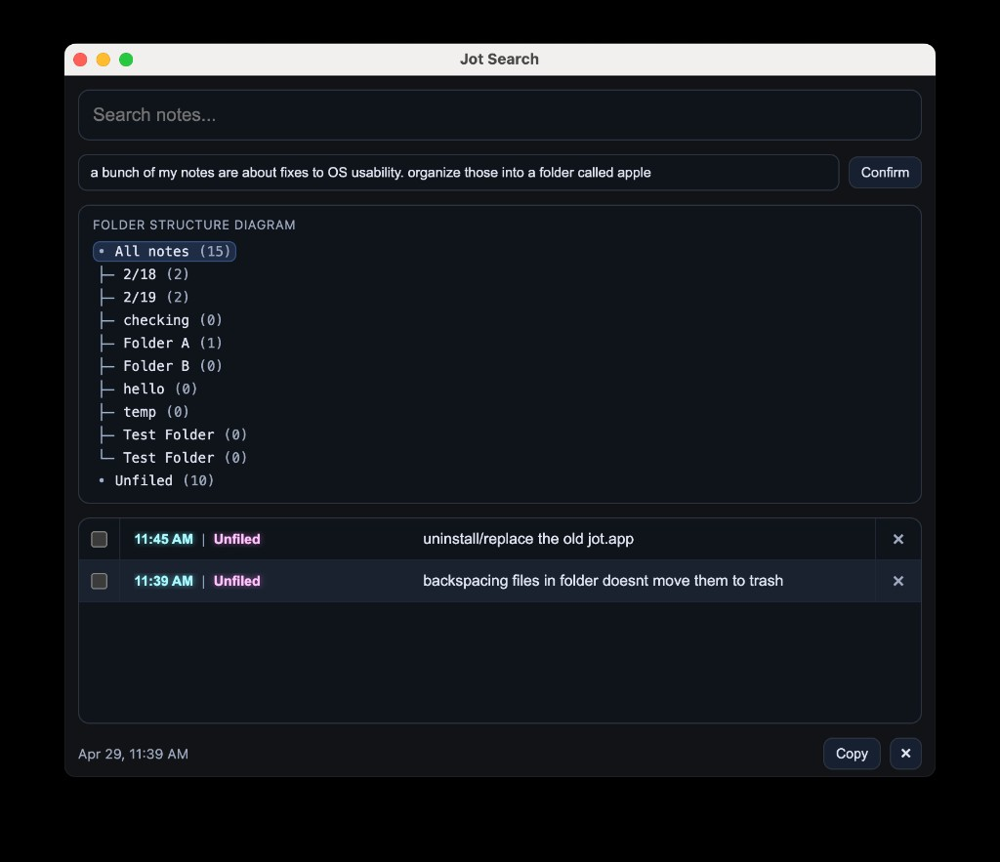
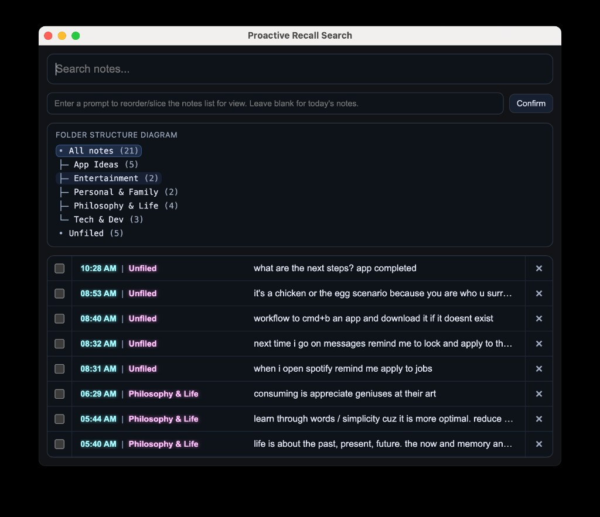

# Packaged App Data Mismatch Investigation

Current status: jot runs correctly with the local DB when launched from Cursor (`npm start`), but data appears incomplete when launched from the downloaded DMG-installed Electron app.

## Observed behavior

- Dev run (`npm start`) shows the full historical dataset.
- Downloaded/installed `jot.app` shows a smaller subset of notes.

## Reference screenshots

- Downloaded `jot.app` (smaller dataset):
  

- Cursor/dev run with full dataset:
  
